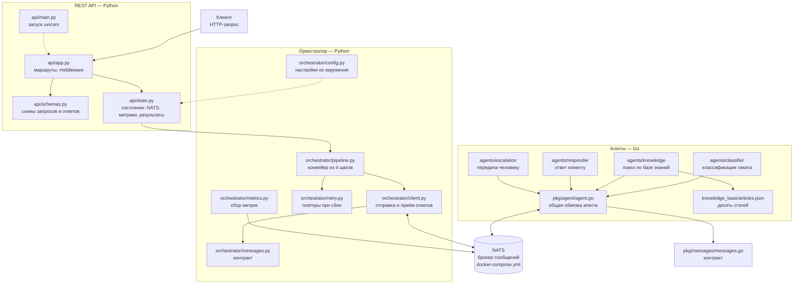
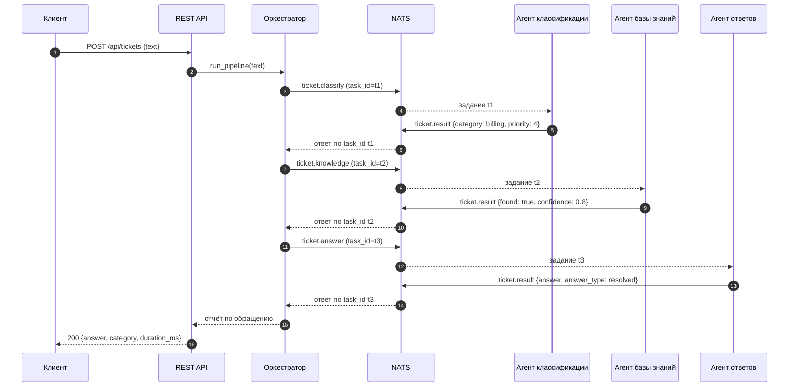
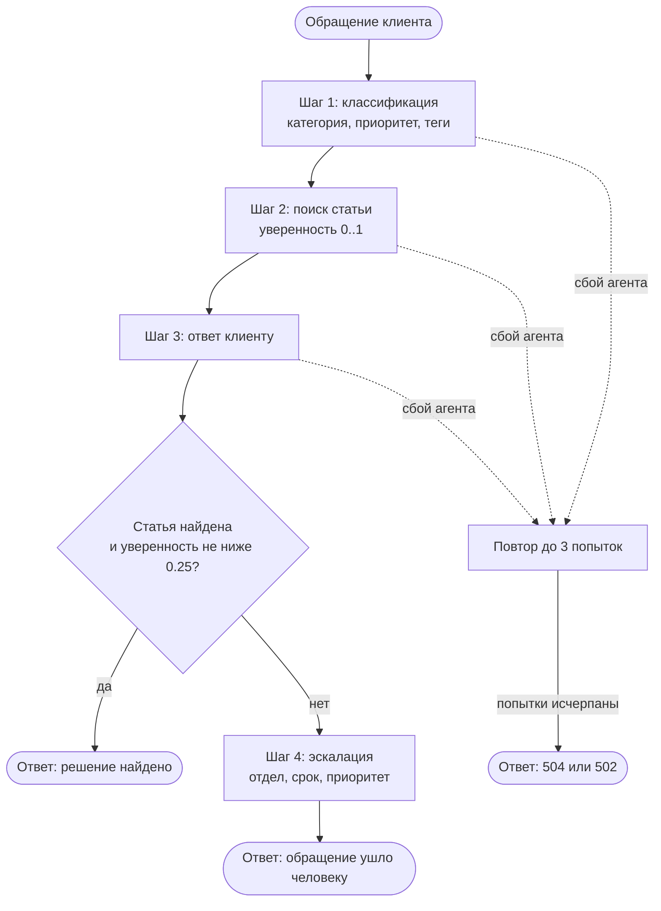
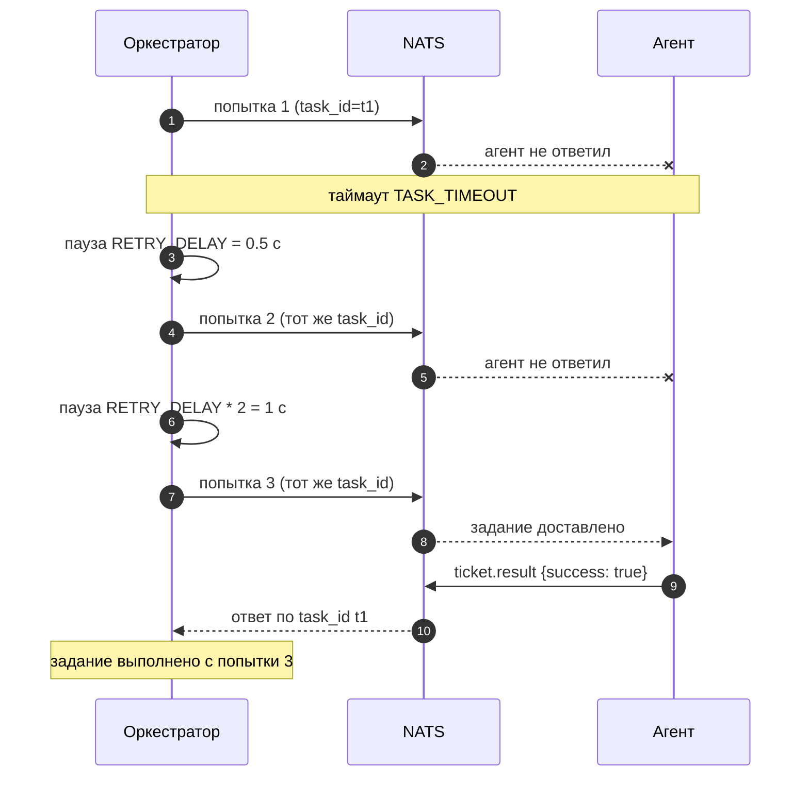

# Архитектура системы

Документ описывает систему автоматизации техподдержки из лабораторной
работы №13 (вариант 2): состав компонентов, их взаимодействие, формат
сообщений, поведение при сбоях и ограничения.

## 1. Обзор

Обращение клиента проходит через четыре агента: классификация тикета,
поиск статьи в базе знаний, формирование ответа клиенту и — если
автоматически закрыть обращение не вышло — эскалация человеку.

Агенты написаны на Go, оркестратор и REST API — на Python. Общаются они
через брокер сообщений NATS. Оркестратор не хранит логику агентов: он
только передаёт данные от одного шага к следующему и решает, что делать с
неполным результатом.

Все сообщения — JSON. Контракт зафиксирован в `agents/AGENTS.md` и
продублирован в двух реализациях: `pkg/messages/messages.go` для Go и
`orchestrator/messages.py` для Python.

## 2. Диаграмма компонентов



## 3. Диаграмма последовательности: успешное обращение



Обращение без найденной статьи добавляет четвёртый шаг — эскалацию, а ответ
клиенту подменяется уведомлением о передаче человеку.

## 4. Диаграмма конвейера с ветвлением



## 5. Диаграмма повторов при сбое агента



При исчерпании попыток наружу поднимается последняя ошибка: таймаут даёт
ответ 504, ошибка агента — 502.

## 6. Описание компонентов

### 6.1 Внешние и инфраструктурные

| Компонент | Назначение |
|-----------|------------|
| Клиент | Отправляет обращение по HTTP в REST API |
| NATS | Брокер сообщений: доставка заданий агентам и ответов оркестратору, раздача заданий между экземплярами одного агента |
| `docker-compose.yml` | Поднимает брокер: `nats:2.10-alpine`, клиентский порт 4222 и HTTP-мониторинг 8222 |

Брокер запускается так:

```bash
docker compose up -d
```

Мониторинг брокера доступен по адресу `http://127.0.0.1:8222`, там видны
подписки тем и число сообщений: `/subsz`, `/connz`, `/varz`.

### 6.2 REST API — Python

| Компонент | Файл | Назначение |
|-----------|------|------------|
| Приложение | `api/app.py` | Маршруты, обработчики ошибок, middleware времени |
| Схемы | `api/schemas.py` | Проверка входа и описание ответа, из них же строится OpenAPI |
| Состояние | `api/state.py` | Подключение к NATS, метрики, хранение результатов, запуск конвейера |
| Запуск | `api/main.py` | Поднимает сервер uvicorn, настраивает логи |

Маршруты:

| Метод | Путь | Назначение | Коды |
|-------|------|------------|------|
| `GET` | `/health` | Состояние API, NATS и список агентов | 200 |
| `GET` | `/api/agents` | Метрики агентов и счётчики оркестратора | 200 |
| `POST` | `/api/tickets` | Обработать обращение и вернуть ответ | 200, 422, 502, 503, 504 |
| `POST` | `/api/tickets/async` | Принять обращение в работу | 202, 422 |
| `GET` | `/api/tickets` | Последние обработанные обращения | 200, 422 |
| `GET` | `/api/tickets/{id}` | Результат одного обращения | 200, 404 |

Состояние приложения не зависит от FastAPI: `create_app(state)` принимает
готовый `AppState`, поэтому тесты подставляют состояние с подменённым
подключением и не требуют брокера.

Запуск:

```bash
python -m api.main
```

По умолчанию сервер слушает `127.0.0.1:8000`, адрес меняется переменными
`API_HOST` и `API_PORT`.

### 6.3 Оркестратор — Python

| Компонент | Файл | Назначение |
|-----------|------|------------|
| Обмен с NATS | `orchestrator/client.py` | Подписка на ответы, отправка заданий, таймаут, раздача ответов по `task_id` |
| Конвейер | `orchestrator/pipeline.py` | Четыре шага обращения, эскалация при неполном результате |
| Повторы | `orchestrator/retry.py` | Повторная отправка задания при сбое агента |
| Метрики | `orchestrator/metrics.py` | Сбор снимков агентов из темы метрик, счётчики оркестратора |
| Настройки | `orchestrator/config.py` | Значения из переменных окружения |
| Контракт | `orchestrator/messages.py` | Зеркало Go-контракта: модели Pydantic |

Ответы агентов приходят в общую тему, поэтому оркестратор подписывается на
неё один раз и раздаёт ответы ожидающим заданиям по идентификатору
`task_id`. Ответ на неизвестное или уже отменённое задание отбрасывается с
предупреждением.

### 6.4 Общая обвязка агента — Go

| Компонент | Файл | Назначение |
|-----------|------|------------|
| Обвязка | `pkg/agent/agent.go` | Подключение к NATS, подписка на группу очереди, разбор JSON, счётчики, логи, метрики, остановка по сигналу |
| Контракт | `pkg/messages/messages.go` | Типы сообщений и темы NATS |

Каждый агент реализует только обработчик одного задания. Подключение,
подписка, разбор, публикация результата, обработка ошибок и завершение
работы берутся из обвязки.

Агент останавливается по SIGINT или SIGTERM: сначала дренирование
соединения, чтобы отдать текущие задания, затем финальная публикация
метрик.

### 6.5 Агенты — Go

| Агент | Файл | Назначение | Очередь |
|-------|------|------------|---------|
| Классификации | `agents/classifier` | Категория обращения, приоритет, теги | `classifiers` |
| Базы знаний | `agents/knowledge` | Подбор статьи и уверенность совпадения | `knowledge-agents` |
| Ответов | `agents/responder` | Текст ответа клиенту и его тип | `responders` |
| Эскалации | `agents/escalation` | Отдел, срок решения, срочность | `escalations` |

**Классификатор** проверяет ключевые слова по правилам в порядке объявления:
первое совпадение задаёт категорию. Порядок важен: обращение «не работает
оплата» должно попасть в `technical`, а не в `billing`. Без совпадений
категория `other` с приоритетом 1.

**Агент базы знаний** разбивает обращение на значимые слова, отбрасывая
служебные и короткие, и сравнивает их со словами статьи по общему началу
длиной не менее четырёх символов. Так запрос «оплатить» находит статью со
словом «оплата». Совпадение категории обращения со статьёй добавляет к
оценке 0.2. Ниже порога `0.25` статья не считается найденной, и обращение
уходит на эскалацию.

**Агент ответов** детерминированный: одинаковый вход даёт одинаковый ответ.
При найденной статье ответ строится на её решении с подсказкой по
категории, без статьи — откладывается до специалиста.

**Агент эскалации** назначает отдел, срок и срочность. Номер эскалации
содержит номер тикета и случайный суффикс, поэтому номера не повторяются
после перезапуска.

### 6.6 Данные

| Данные | Где лежат | Как используются |
|---------|-----------|------------------|
| `knowledge_base/articles.json` | репозиторий | Десять статей базы знаний; агент читает файл при старте |
| Метрики агентов | тема `agent.metrics` | Публикуются агентами по таймеру, собираются оркестратором |
| Результаты обращений | память процесса API | Последние 200 обращений, чтобы забрать ответ асинхронно принятого |

### 6.7 Служебное

| Компонент | Файл | Назначение |
|-----------|------|------------|
| Сборка и запуск агентов | `orchestrator/harness.py` | Общие помощники для демонстраций |
| Демонстрации | `orchestrator/demo_*.py`, `api/demo_api.py` | Проверка заданий 4–8 фактическим выводом |
| Тесты | `pkg/**/*_test.go`, `tests/` | 46 тестов Go и 101 тест Python |

## 7. Темы NATS и сообщения

| Тема | Направление | Содержимое |
|------|-------------|------------|
| `ticket.classify` | оркестратор → классификатор | задание классификации |
| `ticket.knowledge` | оркестратор → база знаний | задание поиска статьи |
| `ticket.answer` | оркестратор → генератор ответа | задание формирования ответа |
| `ticket.escalate` | оркестратор → эскалация | задание передачи человеку |
| `ticket.result` | агент → оркестратор | результат задания |
| `agent.metrics` | агент → оркестратор | снимок счётчиков агента |

Задание:

```json
{
  "task_id": "task-1",
  "type": "answer",
  "ticket": {"id": "ticket-1", "text": "не проходит оплата", "author": "client"},
  "category": "billing",
  "priority": 4,
  "article_id": 1,
  "found": true,
  "attempts": 1
}
```

Результат:

```json
{
  "task_id": "task-1",
  "agent": "responder",
  "instance": "responder-1",
  "success": true,
  "answer": "Проверьте срок действия карты.",
  "answer_type": "resolved"
}
```

Метрики агента:

```json
{
  "agent": "knowledge",
  "queue": "knowledge-agents",
  "instance": "knowledge-1",
  "received": 5,
  "processed": 4,
  "failed": 1,
  "uptime_seconds": 42
}
```

Поле `instance` в ответе показывает, какой из нескольких экземпляров
агента выполнил задание, — без него три одинаковых агента неразличимы.

## 8. Настройки

Агенты, Go:

| Переменная | Назначение | По умолчанию |
|------------|------------|--------------|
| `NATS_URL` | адрес брокера | `nats://127.0.0.1:4222` |
| `INSTANCE_ID` | идентификатор экземпляра | `<хост>:<AGENT_PORT или 0>` |
| `LOG_FILE` | путь к файлу лога | только stderr |
| `LOG_LEVEL` | `DEBUG` включает подробные записи | `INFO` |
| `METRICS_INTERVAL` | период публикации метрик | `10s` |
| `FAULT_FAIL_ATTEMPTS` | сколько первых заданий выполнить с ошибкой | `0` |
| `FAULT_DELAY_MS` | задержка перед ответом | `0` |
| `FAULT_DROP` | `1` — принимать задание и не отвечать | выключено |
| `MIN_CONFIDENCE` | порог релевантности статьи | `0.25` |

Оркестратор и API, Python:

| Переменная | Назначение | По умолчанию |
|------------|------------|--------------|
| `NATS_URL` | адрес брокера | `nats://127.0.0.1:4222` |
| `TASK_TIMEOUT` | сколько ждать ответ агента на одну попытку, с | `5` |
| `MAX_ATTEMPTS` | попыток отправки всего, включая первую | `3` |
| `RETRY_DELAY` | пауза перед первым повтором, с | `0.5` |
| `RETRY_BACKOFF` | во сколько раз растёт пауза | `2.0` |
| `RETRY_MAX_DELAY` | верхняя граница паузы, с | `5.0` |
| `RETRY_JITTER` | доля случайного разброса паузы | `0.1` |
| `RETRY_ON_AGENT_ERROR` | повторять ли при ошибке агента | `true` |
| `API_HOST` | адрес сервера API | `127.0.0.1` |
| `API_PORT` | порт сервера API | `8000` |
| `LOG_LEVEL` | уровень логирования | `INFO` |
| `LOG_FILE` | путь к файлу лога | только консоль |

## 9. Отказоустойчивость

Что сделано:

- **Таймаут ожидания.** Ответ агента ждётся не дольше `TASK_TIMEOUT`;
  иначе шаг помечается проваленным и клиент получает 504, а не висящее
  соединение.
- **Повторы.** Задание отправляется заново с тем же `task_id` при таймауте
  или ошибке агента: не больше трёх попыток всего, пауза растёт
  геометрически и слегка разбросана.
- **Группы очередей.** Задание уходит ровно одному экземпляру агента:
  дубли и потери невозможны на уровне брокера.
- **Корректная остановка.** По SIGINT и SIGTERM агент дренирует соединение
  и публикует финальные метрики.
- **Мониторинг.** Счётчики агентов видно по теме метрик, счётчики
  оркестратора — через `/api/agents`. Агент, который перестал отвечать,
  виден по отсутствию свежих метрик.
- **Проверка входа.** Текст короче 5 символов и лишние поля в запросе
  отклоняются с 422.

Чего нет и почему:

- **Постоянного хранилища.** JetStream не используется: система работает
  на обычных темах NATS, а результаты хранятся в памяти процесса API.
  Задание в очереди не переживает перезапуск брокера.
- **Аутентификации и авторизации.** API доступен локально и не требует
  токена.
- **Разделения ошибок на постоянные и временные.** Повтор настраивается
  общим правилом; разделение потребовало бы классификации ошибок в
  контракте.
- **Горизонтального масштабирования по нагрузке.** Экземпляры запускаются
  вручную, автоматического добавления нет.

## 10. Запуск всей системы

```bash
docker compose up -d

# агенты
$env:METRICS_INTERVAL = "2s"
foreach ($a in @("classifier","knowledge","responder","escalation")) {
    $env:LOG_FILE = "logs\$a.log"
    go run "./agents/$a"
}

# API
python -m api.main
```

Проверка сквозного пути фактическим выводом:

```bash
python -m orchestrator.demo_pipeline    # весь конвейер
python -m orchestrator.demo_metrics     # логирование и мониторинг
python -m orchestrator.demo_retry       # повторы и таймауты
python -m orchestrator.demo_instances   # несколько экземпляров агента
python -m api.demo_api                  # REST API по HTTP
go test ./...                           # тесты агентов
python -m pytest tests/                 # тесты оркестратора
```